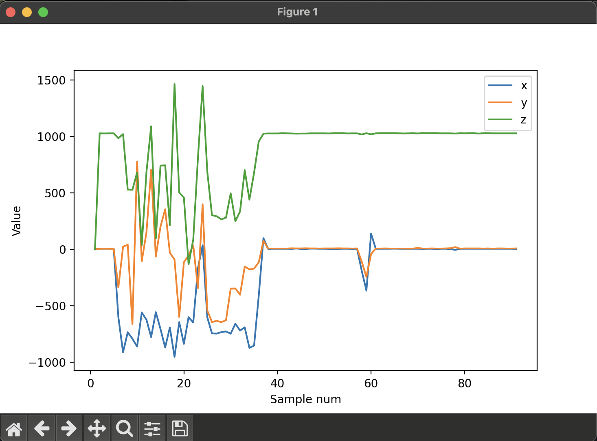

# Homework 2 - Socket Programming and Data Visualization

## Group 1
- **賴群貿:** B09901186 
- **陳冠霖:** B09901162

## Usage
This example shows the usage of sending the sensor value of 3D Accelerator from STM32, receiving the data to a Linux/Windows/Mac host, and visualizing the value with ```matplotlib```.

### Initialization

1. Connect your laptop with your wifi and check your IP address.
2. In ```./mbed_app.json``` file, update the hostname with the IP address you obtain and also fill in the wifi's SSID and password. Note that the wifi should be the same as the one your laptop connecting to.
3. In ```./ws_server.py``` file, update the ```HOST``` parameter with the IP address of your laptop.
4. Run the following command on your laptop:
```
python ws_server.py
```
5. Connect STM32 with your laptop and compile the code for this project. Then run the code on STM32.
6. Now you should see the figure plotted by ```ws_server.py``` like this:



## Credit

This project originates from the [official ARMmbed example repository](https://github.com/ARMmbed/mbed-os-example-sockets). 

## License

The software is provided under Apache-2.0 license. Contributions to this project are accepted under the same license.
Please see [contributing.md](CONTRIBUTING.md) for more info.